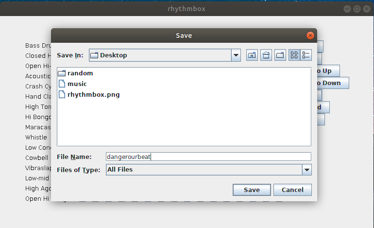

# rhythmbox
Desktop app that creates beats from 16 percussion instruments. Create, save and upload beats of varying tempo. 

## Prerequisites
OpenJDK Runtime Environment (build 1.8.0)
Apache Maven 3.6.0

## Execution
Navigate to ***beatbox/***

Build jar ```mvn clean install```. This creates a jar called beatbox-1.0-SNAPSHOT.jar.

run jar ```java -jar beatbox-1.0-SNAPSHOT.jar```


## Screenshots



